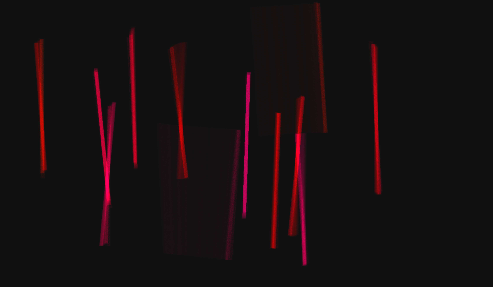

BIOSYSTEMS
======

Biosystems repository. Contains the Biosystems player at ./player directory and generative tool.

Example provided at ./player/player.html



Hosting the generative tool
-------------

Copy files from ./docs onto web server


Run local
-------------

* Install Node and NPM ( https://nodejs.org/en/ ) 🙏

* $ npm i && npm start

* Open Google Chrome at localhost:1234


Player usage
-------------

Include the library located at: ./player/player.js at the end of your HTML's body.

```js
<script src="player.js"></script>
```

Add HTML tags with the class .bioplayer

```html
<div class="bioplayer"></div>
```

Set options using the dataset attribute on tag:
```html
<div class="bioplayer" id="main" data-density="4" data-bgcolor="#222222" data-fgcolor="#cccccc"></div>
<div class="bioplayer" id="t1" data-seed="antonio perez" data-density="8" data-trail="1"></div>
<div class="bioplayer" id="t2" data-seed="maria ramos" data-spreadx="1" data-fgcolor="#cc66cc" data-ramp="0.3" data-scale="0.7"></div>
```

Player options
-------------

- `seed` 
    - Type : String
    - Default : random
    - Creates a constant composition and color basing random parameters on specified string

- `density` 
    - Type : Int ( 0 -> 32 )
    - Default : 12
    - Defines amount of bars in composition

- `spreadx` 
    - Type : Float ( 0 -> 1 )
    - Default : 1
    - Defines random placement in x-axis

- `spready` 
    - Type : Float ( 0 -> 1 )
    - Default : 0.6
    - Defines random placement in y-axis

- `rotation` 
    - Type : Float ( 0 -> 2 * PI )
    - Default : 0.5
    - Defines amount of rotation of bars

- `scale` 
    - Type : Float ( 0 -> 1 )
    - Default : 0.9
    - Defines amount of random scale divergence applied to bars

- `continuity` 
    - Type : Float ( 0 -> 1 )
    - Default : 0.2
    - Defines how often bar is randomized

- `trail` 
    - Type : Float ( 0 -> 1 )
    - Default : 0.35
    - Defines density of bar's trail

- `bgcolor` 
    - Type : Hex ( #nnnnnn )
    - Default : #111111
    - Defines background color

- `fgcolor` 
    - Type : Hex ( #nnnnnn )
    - Default : random
    - Defines bars color

- `ramp` 
    - Type : Float ( 0 -> 1 )
    - Default : 0.1
    - Defines how much hue variation is applied to fgcolor